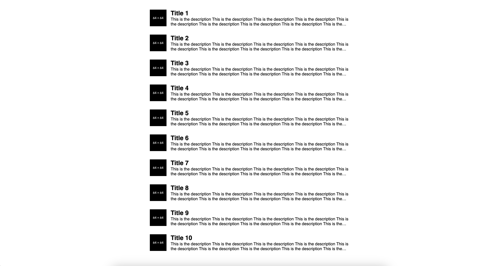

# Tasks

Please note that there is a **HTML page with CSS** and **2 javascript functions** to implement.

Your solutions should be submitted in form of a PR to the main branch with a proper branch name. Please don't merge this PR.


## HTML/CSS

You can find the task in
* `zh/html-css/index.html`
* `zh/html-css/styles.css`

The task description is written in the HTML file in a comment. e.g.
```html
<!-- TODO: Create HTML template here -->
```

You can find a reference to the expected output in `zh/html-css/image.png`



## JS

There are 2 functions to implement. If all unt tests pass, you can consider the implementation successful. Feel free to use any built-ins, documentation, help, etc. for your solution.

You can find this in:
* `zh/js/index.js`


The details are written in the form of jsdoc comments for both functions e.g. 
```javascript
/**
 * Creates a simple object for HTTP headers based on the input.
 */
```

Before you begin, make sure the project is properly set up.
* `cd <location you cloned the repository to>`
* `npm install`

To run tests:
* `npm run test`

## Submitting your solution

Make sure both tasks are completed. If you feel so, open a PR to the main branch from your dedicated branch e.g. `main <-- zh/jordan-szalontai`
